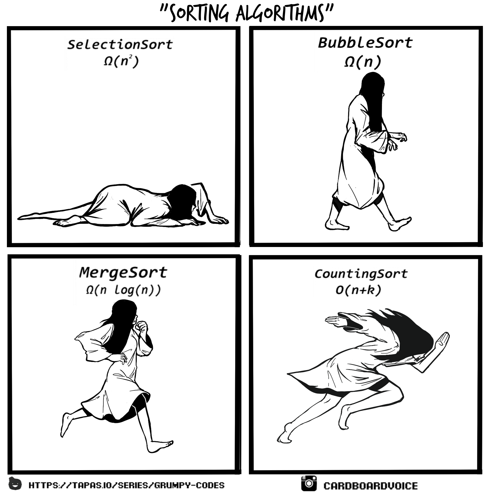

# Sorting Algorithms

Welcome to the **Sorting Algorithms** project! This repository contains implementations of various sorting algorithms, designed to help you understand and explore the inner workings of these fundamental computer science concepts.

---

## About the Developer

Hi, I'm [Trey](https://www.linkedin.com/in/TreyvonTurner), a passionate software engineer with a keen interest in algorithms and data structures. You can explore more of my work on my [Portfolio](https://github.com/AfroCircus64). I enjoy solving complex problems and sharing my knowledge with the developer community.

---

## Project Description

This project is a comprehensive exploration of sorting algorithms, ranging from simple methods like Bubble Sort to more advanced techniques like Quick Sort and Merge Sort. Each algorithm is implemented in C, with a focus on clarity and efficiency. The repository is structured to allow easy navigation and understanding of each algorithm.

### Key Features:
- **Implemented Algorithms**:
  - Bubble Sort
  - Insertion Sort
  - Selection Sort
  - Merge Sort
  - Quick Sort
  - Heap Sort
- **Performance Analysis**:
  - Each algorithm includes time complexity and space complexity analysis.

### Features to Be Implemented:
- Visualization of sorting algorithms for better understanding.
- Parallelized versions of sorting algorithms for performance optimization.
- Additional sorting algorithms like Radix Sort and Counting Sort.

---

## Development Story

The journey of developing this project was both challenging and rewarding. It began as a simple exercise to implement basic sorting algorithms but quickly evolved into a deeper dive into algorithmic efficiency and optimization. 

One of the most exciting parts of this project was comparing the performance of different algorithms on large datasets. It was fascinating to see how algorithms like Merge Sort and Quick Sort outperformed others in terms of time complexity.

---

## Challenges Encountered

1. **Understanding Algorithmic Trade-offs**:
   - Balancing time complexity and space complexity was a recurring challenge. For example, while Merge Sort is efficient, its additional memory requirements posed interesting constraints.

---
